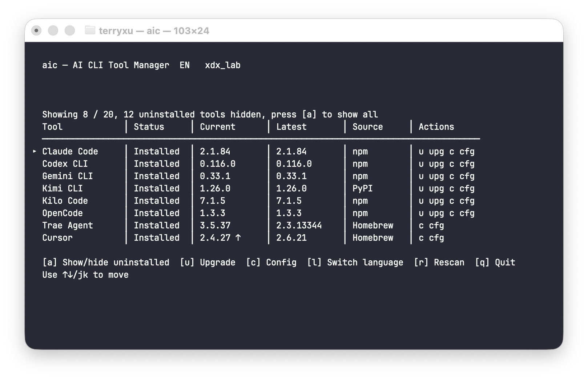
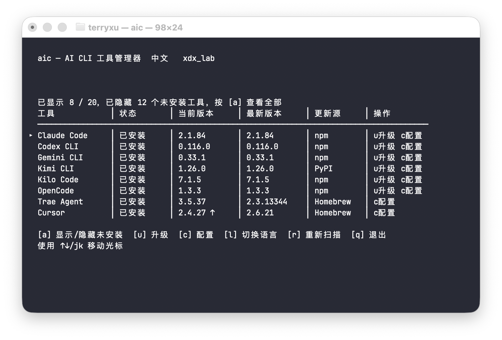

# aic

`aic` 是一个终端里的 AI CLI 工具管理器。

它用于统一查看本机常见 AI CLI 工具的安装状态、当前版本、最新版本和更新源，并在同一个界面里完成升级或打开配置文件。

英文界面预览：



中文界面预览：



## 核心功能

- 扫描本机常见 AI CLI 工具
- 显示当前版本、最新版本和更新源
- 默认只显示已安装工具，也可以切换查看全部候选工具
- 直接升级当前选中的工具
- 直接打开当前工具的配置文件

## 常见工具

当前主要面向常见工具，例如：

- `Claude Code`
- `Codex CLI`
- `Gemini CLI`
- `Aider`
- `Qwen Code`
- `Kimi CLI`
- `Cursor`
- `Windsurf`
- `Trae Agent`

README 只列出常见工具，不承诺覆盖所有工具。

## 运行方式

项目的目标入口是：

```bash
aic
```

无论是你自己长期使用，还是后续提供给其他用户，最终都应该直接通过 `aic` 命令进入。

## 安装方式

### 方式一：从 GitHub Release 下载

发行版下载地址：

- <https://github.com/xdx888999/aic/releases>

请根据你的系统下载对应压缩包：

- macOS Apple Silicon：`aic_darwin_arm64.tar.gz`
- macOS Intel：`aic_darwin_amd64.tar.gz`
- Linux amd64：`aic_linux_amd64.tar.gz`
- Linux arm64：`aic_linux_arm64.tar.gz`

下载后解压，并将 `aic` 放入你的 `PATH` 目录，例如：

```bash
mv aic /usr/local/bin/aic
```

完成后即可直接运行：

```bash
aic
```

### 方式二：通过 Homebrew 安装

```bash
brew tap xdx888999/homebrew-tap
brew install xdx888999/homebrew-tap/aic
```

安装完成后即可直接运行：

```bash
aic
```

### 方式三：源码本地安装

目前也可以通过源码本地安装：

```bash
go build -o aic .
mv aic /usr/local/bin/aic
```

完成后即可直接运行：

```bash
aic
```

如果你使用个人目录，也可以放到：

```bash
~/bin/aic
```

前提是该目录已经加入 `PATH`。

## 常用操作

- `↑ / ↓` 或 `j / k`：移动光标
- `u`：升级当前工具
- `c`：打开配置文件
- `a`：显示或隐藏未安装工具
- `l`：切换语言
- `r`：重新扫描
- `q`：退出

## 开发

本地运行：

```bash
go run .
```

运行测试：

```bash
go test ./...
```

## 署名

`xdx_lab`

- X: <https://x.com/terry13O>
- GitHub: <https://github.com/xdx888999>
